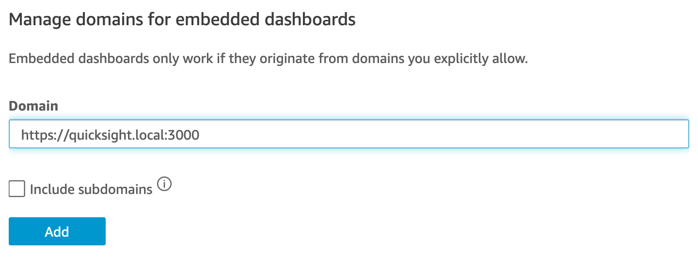

# QuickSights Embedded Dashboard demo

This demo serves to demonstrate how an AWS QuickSight dashboard can be embedded within a Next.js application.

## Setup

### `.env.local`

Populate `.env.local` with the following variables:

```
AWS_PROFILE=
AWS_ACCOUNT_ID=
DASHBOARD_ID=
ADMIN_USERNAME=
ANON_USERNAME=
```

### Configure hostname

For QuickSight to support embedding, it must be running in "Enterprise" mode. Within AWS QuickSight, you will need to explicitely permit a domain within the "Domains and Embedding" section of the QuickSight management console.



You will also need to add that domain name to your `/etc/hosts` file:

```
127.0.0.1 quicksight.local
```

### Run application

1. Start server on HTTP: `PORT=3001 npm run dev`
2. Proxy requests from HTTPS to HTTP: `npx local-ssl-proxy --source 3000 --target 3001`

Assuming that you have configured your hostnames with `quicksight.local`, your application should now be available at https://quicksight.local:3000